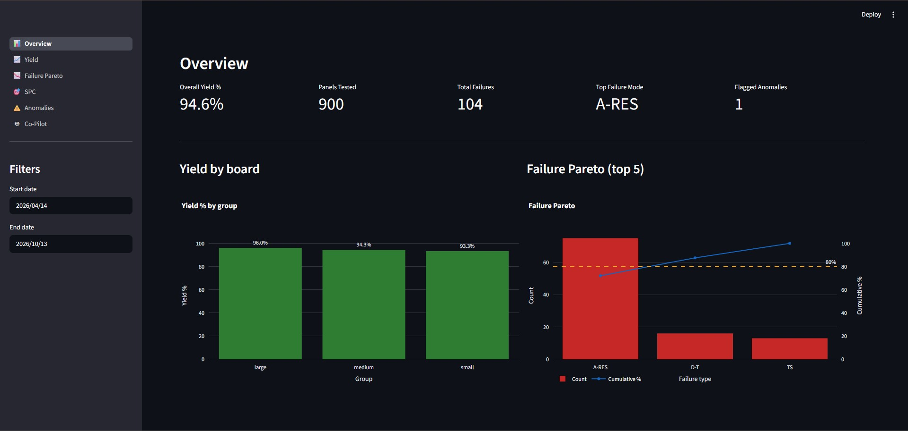
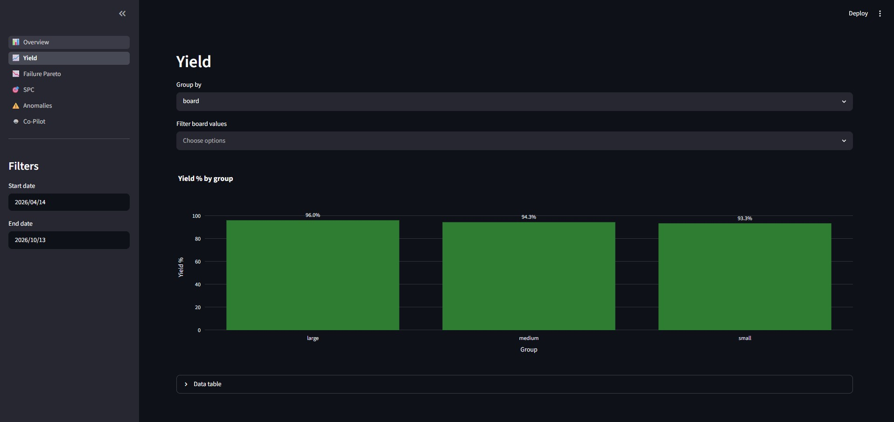
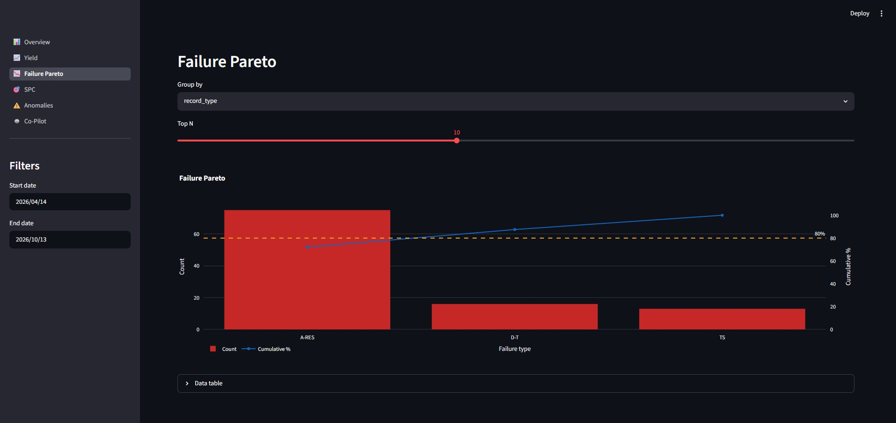
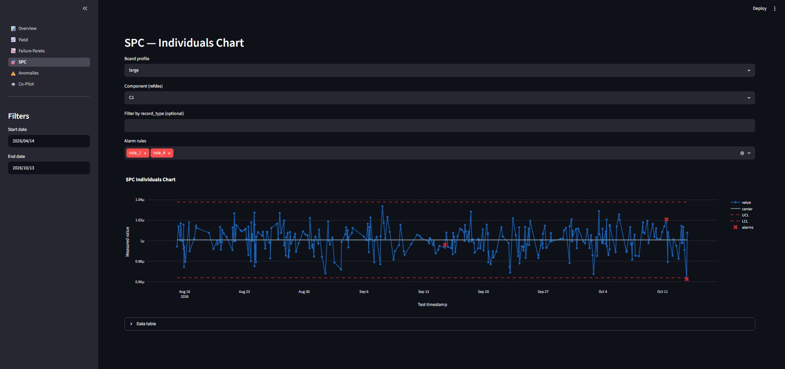
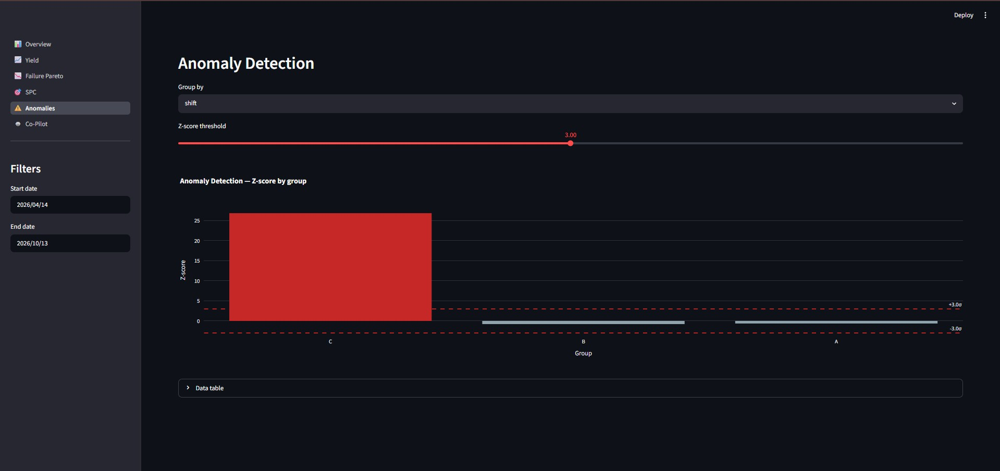
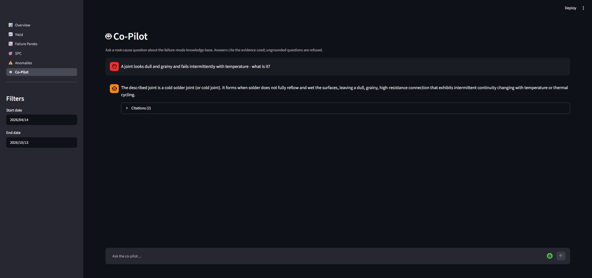
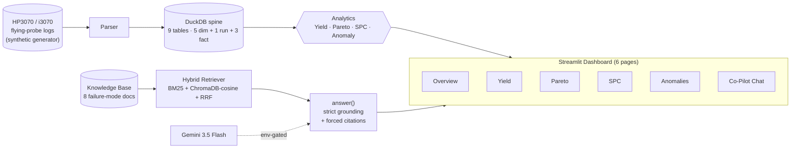

# Flying-Probe / ICT Test-Log Intelligence Co-Pilot

> A Python system that ingests PCBA flying-probe / ICT test logs into a SQL database, runs yield + Pareto + SPC + anomaly analytics, and answers natural-language root-cause questions through a strictly-grounded RAG co-pilot.


---

## Dashboard at a glance

| | | |
|---|---|---|
|  |  |  |
| **Overview** — KPIs + window summary | **Yield** — yield by board / shift / line / operator | **Pareto** — top failures by record type |
|  |  |  |
| **SPC** — Shewhart individuals chart (Wheeler XmR) | **Anomalies** — leave-one-out z-score | **Co-Pilot** — grounded RAG chat with citations |

---

## Why this exists

PCBA manufacturers run flying-probe and in-circuit testers that emit huge volumes of structured test logs — but the analytics layer is either commercial-and-expensive (Nick's Software NS-HPDCA) or absent. Process engineers end up doing yield analysis in Excel and root-causing failures from memory. This project closes the gap with an open, local-first, AI-assisted co-pilot that reads test logs, runs the standard SPC + Pareto + anomaly analytics, and answers natural-language root-cause questions with citations to a curated failure-mode knowledge base.

It is also the **flagship portfolio project** built to land a Manufacturing / Process Engineer with AI role at a Dallas-area EMS firm.

[**Read the long-form case study →**](docs/case-study.md)

---

## What's inside

- **Synthetic log generator** — produces Keysight Log Record Format (HP3070 / i3070-style) logs with configurable fault correlation, three board profiles, three shifts, and shift-physics-aware timestamps. ~1 s for 1,000 panels.
- **Parser + DuckDB spine** — 9-table schema (5 dim + 1 run + 3 fact), idempotent ingest, byte-precise round-trip integrity.
- **Analytics library** — `yield_over_time`, `failure_pareto`, `individuals_chart` (Wheeler XmR + run-of-8), `z_score_anomalies` (leave-one-out severity-first). Pure functions, no notebook dependency.
- **Hybrid RAG co-pilot** — ChromaDB-cosine + rank-bm25 with Reciprocal Rank Fusion over an 8-document failure-mode knowledge base, grounded answers with forced citations, strict anti-hallucination refusal when evidence is insufficient.
- **Streamlit dashboard** — 6 pages (Overview / Yield / Pareto / SPC / Anomalies / Co-Pilot chat).
- **519 tests / 97% coverage / 10/10 live RAG eval** verified end-to-end at every phase boundary.

---

## Architecture



The KB-grounded RAG layer and the DuckDB-driven analytics layer are independent. Both feed the dashboard; the co-pilot grounds on the failure-mode knowledge base, not on DuckDB rows, by design.

---

## Tech stack

| Layer | Choice | Why |
|---|---|---|
| Language | Python 3.11+ | Standard for ML / data |
| Package manager | `uv` | Fast resolution + lockfile |
| Database | DuckDB | File-based, analytics-fast, zero-ops |
| Vector store | ChromaDB (cosine HNSW) | Local, no service required |
| Lexical search | `rank-bm25` | Hybrid RAG completeness |
| Embeddings | `sentence-transformers` (all-MiniLM-L6-v2) | Free, local, deterministic |
| LLM | Google Gemini 3.5 Flash | Fast + JSON mode + cheap |
| UI | Streamlit + Plotly | Fastest path to a working dashboard |
| Tests | pytest | 519 passing, 97% coverage |

---

## Quickstart

```bash
# 1. Install
uv sync

# 2. Generate a synthetic batch (20 panels, small board profile)
uv run generator --board-profile=small --count=20 --out=data/synthetic

# 3. Ingest into DuckDB (use the stamped run dir the generator just created)
RUN_DIR=$(ls -dt data/synthetic/run_* | head -1)
uv run parser --input="$RUN_DIR" --db=data/db/sample.duckdb

# 4. (Optional) Set up Gemini for the Co-Pilot page
cp .env.example .env  # then paste your GOOGLE_API_KEY

# 5. Launch the dashboard
uv run streamlit run src/flying_probe_copilot/ui/app.py

# 6. Run the test suite
uv run pytest -q

# 7. Run the env-gated live RAG eval (≥8/10 exit criterion)
RAG_RUN_LLM_EVAL=1 uv run pytest tests/test_rag/test_eval.py::test_eval_live_at_least_8_of_10 -v
```

---

## Project structure

```
flying-probe-copilot/
├── README.md                           # you are here
├── CLAUDE.md                           # session memory bridge
├── pyproject.toml                      # uv-managed deps + scripts
├── docs/
│   ├── case-study.md                   # long-form portfolio writeup
│   ├── SCOPE.md, ROADMAP.md, DECISIONS.md, GUARDRAILS.md, REQUIREMENTS.md
│   ├── knowledge-base/failure-modes/   # 8 KB docs (synthetic, guardrail-safe)
│   ├── eval/                           # 10-question eval dataset + run instructions
│   ├── img/                            # README + case-study screenshots
│   ├── logs/                           # SESSION_LOG, DECISION_LOG, BUG_LOG
│   └── plans/                          # per-session briefs + plans
├── src/flying_probe_copilot/
│   ├── generator/                      # Phase 1a — synthetic Keysight-format logs
│   ├── parser/                         # Phase 1b — parse + ingest
│   ├── db/schema.py                    # Phase 1b — 9-table DuckDB schema
│   ├── analytics/                      # Phase 2 — yield, pareto, SPC, anomaly
│   ├── rag/                            # Phase 3 — retrieval, prompts, answer, LLM
│   └── ui/                             # Phase 3 — Streamlit dashboard + chat
├── tests/                              # 519 passing, 97% coverage
├── notebooks/                          # 01-queries.ipynb (analytics sketches)
└── data/                               # all gitignored except samples/
```

---

## Documentation map

| Doc | What's in it |
|---|---|
| [docs/case-study.md](docs/case-study.md) | Long-form story: problem, scope decisions, architecture, three engineering stories, results |
| [docs/SCOPE.md](docs/SCOPE.md) | What's in and out of scope, v1 boundaries |
| [docs/GUARDRAILS.md](docs/GUARDRAILS.md) | Non-negotiables (no real customer data, no IPC verbatim, no Keysight wholesale) |
| [docs/ROADMAP.md](docs/ROADMAP.md) | Phased plan + per-phase definition-of-done |
| [docs/DECISIONS.md](docs/DECISIONS.md) | Architecture Decision Records |
| [docs/REQUIREMENTS.md](docs/REQUIREMENTS.md) | Skills, tools, resources |
| [docs/eval/phase3-eval-questions.md](docs/eval/phase3-eval-questions.md) | The frozen 10-question Phase 3 RAG eval set |
| [docs/logs/](docs/logs) | Session log, decision log, bug log |

---

## Status & roadmap

| Phase | Goal | Status |
|---|---|---|
| 0 — Setup | Docs, scope, guardrails, repo skeleton | ✅ Complete |
| 1a — Synthetic data | HP3070-style log generator | ✅ Complete |
| 1b — Parser & DB | Log parser + DuckDB schema | ✅ Complete |
| 2 — Analytics | SPC, Pareto, anomaly detection, dashboard v1 | ✅ Complete |
| 3 — RAG co-pilot | Hybrid RAG + grounded answer + live eval | ✅ Complete (2026-06-21, 10/10 live eval) |
| 4 — Polish | README, demo gif, case-study, portfolio writeup | 🚧 In progress (slice 1 — this README) |

---

## Contributing & license

Solo portfolio project, not accepting external PRs at this time. Licensed [MIT](LICENSE).

## About the author

Built by **Hrushiekesh Reddy Kanjula** — Manufacturing Engineer based in Dallas, TX, with ~4 years of PCBA experience. This project is the portfolio piece for transitioning into a Manufacturing / Process Engineer with AI role.

- 🔗 [Portfolio](https://hrushiekeshreddykanjula.com/)
- 💼 [LinkedIn](https://www.linkedin.com/in/hrushiekesh-reddy-k-ab0435136/)
