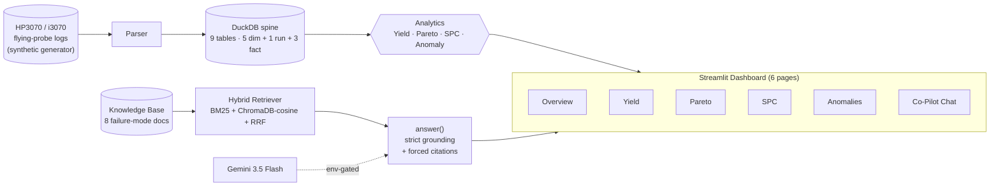

## Plan — 2026-06-21 — Phase 4 slice 1 (README polish + portfolio writeup)

> Companion docs: [brief](2026-06-21-phase4-slice1-brief.md) (goal + scope), Step-2 Explore report inline in session.
> **Revision 1 (2026-06-21)** — addresses Step-5 red-team. Changes flagged inline as `**[Rev 1]**`.

### Goal Contract (one sentence)
Rewrite [README.md](../../README.md) with a Phase-3-shipped narrative and Mermaid architecture diagram, capture a 6-page Streamlit screenshot strip into `docs/img/`, and author a ~2,000-word [docs/case-study.md](../case-study.md) anchored on three named engineering stories and the verified metrics suite — so the GitHub landing page reads as a finished portfolio piece to a Dallas-area EMS Manufacturing Engineering hiring manager.

### Scope boundaries (hard)
- ✅ Touch only: `README.md`, `docs/case-study.md` (new), `docs/img/*` (new), `CLAUDE.md` (session-log line + status block ONLY at Step 10), `docs/logs/{SESSION_LOG,BUG_LOG}.md` (Step 10).
- ❌ Do NOT touch: `pyproject.toml`, `src/flying_probe_copilot/**`, `tests/**`, `docs/{SCOPE,DECISIONS,GUARDRAILS,REQUIREMENTS,SKILLS}.md`, `docs/eval/**`, `.env.example`, `.claude/**`, `migrations/**`.
- ⚠️ **[Rev 1]** `docs/ROADMAP.md` — **conditional**. Per `.claude/rules/agent-conduct.md` line 64, completed deliverables get ticked at Step 10. ROADMAP edits limited to the **Phase 4 deliverables tick** (one or two lines). Surface to Decision Gate for owner ratification.
- ❌ Do NOT add new deps. Mermaid renders natively on GitHub.
- ❌ Real customer data, IPC verbatim, Keysight wholesale — guardrails hold for every screenshot + writeup line.
- ⚠️ **[Rev 1]** Generator output (`data/synthetic/run_*`) and `data/db/sample.duckdb` are **intentionally gitignored** — only `docs/img/*.png` is committed from the screenshot capture workflow.

### Workflow tier (Rev 1 explicit)
**[Rev 1]** Reduced Medium loop: **Steps 1 → 2 → 3 → 5 → 6 → 7 → 8 → 9 → 10**. **Skip Step 4** (no tests authored this slice; existing suite must stay green). **Step 11 Manual QA** = owner reads the GitHub-rendered README on `feature/phase4-slice1-readme` (or the merged main) and confirms hero strip + Mermaid render correctly.

### What / Why / Where / When file table

| File | What | Why | When (order) |
|---|---|---|---|
| `docs/img/` (new dir) | Container for 6 PNG screenshots + Mermaid SVG export (optional) | Single home for visual assets; referenced from README + case-study | Step 1 |
| `docs/img/screenshot-overview.png` | Dashboard Overview page (KPIs + summary) | Hero strip image #1 | Step 2a |
| `docs/img/screenshot-yield.png` | Yield page (yield-by-board bar chart) | Hero strip image #2 | Step 2b |
| `docs/img/screenshot-pareto.png` | Pareto page (top failures bar) | Hero strip image #3 | Step 2c |
| `docs/img/screenshot-spc.png` | SPC page (individuals/XmR chart with rules) | Hero strip image #4 | Step 2d |
| `docs/img/screenshot-anomalies.png` | Anomalies page (z-score table) | Hero strip image #5 | Step 2e |
| `docs/img/screenshot-copilot.png` | Co-Pilot chat page answering a real grounded question with citations | Hero strip image #6 — most evocative; needs live key | Step 2f |
| `README.md` | Full rewrite: problem → solution → hero strip → status → architecture (Mermaid) → stack → install → run → project structure → docs map → contributing → license | Phase-0 wording removed; portfolio-grade; the 60-second hiring-manager read | Step 3 |
| `docs/case-study.md` (new) | ~2,000-word long-form: problem framing, scope decisions, architecture story, RAG-specific design, three engineering stories (BUG-004, BUG-013, BUG-011), results | Embeddable on portfolio site; the deep-dive companion to the README | Step 4 |
| `CLAUDE.md` | Append Phase 4 session-log line + flip Status block from "Phase 3 EXIT CRITERION MET" → "Phase 4 slice 1 shipped" | Step 10 only — per agent-conduct, gated edit limited to log block | Step 5 (Docs) |
| `docs/logs/SESSION_LOG.md` | New 2026-06-21 entry for the slice (or extend today's entry if not yet committed) | Per agent-conduct testing.md / session-workflow.md Step 10 | Step 5 (Docs) |
| `docs/logs/BUG_LOG.md` | No new entries expected (this slice is pure docs); only edit if a real bug surfaces during screenshot capture | Step 5 (Docs) |

### Mermaid architecture diagram (skeleton for Step 3 execution)

**[Rev 1]** Quoted-label syntax `["..."]` everywhere — no HTML-entity encoding of parens.

Naming + layout to be refined during Step 3; node count fixed. **[Rev 1]** Step 8 verification adds: paste skeleton into mermaid.live or `gh markdown preview` to confirm it renders cleanly on GitHub before merge.

**[Rev 1] Narrative guardrail (W-1):** `answer()` grounds on **KB only** today (not DuckDB rows). README + case-study must say "RAG over the failure-mode knowledge base" — NOT "RAG over query results". DuckDB → analytics → dashboard is a parallel pipeline; the two streams meet only inside the Streamlit UI.

### README.md target outline (sections + approximate length)

| § | Section | Lines | Notes |
|---|---|---|---|
| 1 | Title + tagline + status badge row | ~10 | "Phase 3 shipped 2026-06-21" badge; MIT license; Python 3.11+ |
| 2 | Hero screenshot strip (6 panels) | ~5 | Markdown table or `<picture>` block, references `docs/img/*.png` |
| 3 | Why this exists (problem + solution) | ~25 | One para problem, one para solution, one para portfolio framing |
| 4 | What's inside (60-second elevator) | ~20 | Bullets: synthetic logs · parser · analytics · RAG · dashboard |
| 5 | Architecture (Mermaid) | ~30 | The Mermaid block from skeleton above |
| 6 | Tech stack | ~15 | Locked stack from CLAUDE.md, tabular |
| 7 | Quickstart | ~30 | uv install → generate → ingest → run dashboard → ask a question |
| 8 | Project structure | ~25 | Tree of top-level dirs with one-line descriptions |
| 9 | Documentation map | ~15 | Links to SCOPE / ROADMAP / DECISIONS / GUARDRAILS / case-study |
| 10 | Status & roadmap | ~15 | Phase table from CLAUDE.md (verbatim values) |
| 11 | Contributing + license | ~10 | "Solo portfolio project, not accepting PRs; MIT" |
| **Total** | | **~200** | Replaces the current 100ish lines of Phase-0 prose |

### docs/case-study.md target outline (sections + approximate word counts)

| § | Section | Words | Anchors |
|---|---|---|---|
| 1 | The problem (PCBA / ICT logs landscape) | ~250 | Manufacturer pain, commercial alternatives gap, owner's day-job perspective |
| 2 | Scope decisions | ~300 | Why synthetic data, why local-only, why Streamlit, why DuckDB, why hybrid RAG. Cite [docs/DECISIONS.md](../DECISIONS.md). |
| 3 | Architecture | ~300 | Walk the Mermaid diagram. KB vs DuckDB grounding. The 6 pages. |
| 4 | Three engineering stories | ~700 | One per: BUG-004 (calendar/shift rigor), BUG-013 (anti-hallucination + model retirement diagnosis), BUG-011 (concurrency test isolation). ~230 each. |
| 5 | RAG design choices | ~250 | Hybrid retrieval (BM25+vector+RRF). Anti-hallucination grounding rules. Frozen 10-Q eval dataset + offline citation-pattern proof + env-gated live ≥8/10. |
| 6 | Results | ~150 | 519 passing / 97% coverage / 10/10 live eval / 37s end-to-end / 1k panels in ~1s / 97 commits / 28 PRs (verify counts before writing). |
| 7 | What I'd do differently | ~150 | Honest retrospective: SDK migration backlog (BUG-013 follow-up), demo-gif slice, real-data validation only happens on the work network. |
| **Total** | | **~2,100** | |

### Screenshot capture procedure

**[Rev 1] B-2 fix:** `generator --out=DIR` writes its data under `DIR/run_<YYYY-MM-DDTHH-MM-SS-%f>/` (verified in [src/flying_probe_copilot/generator/cli.py:73-74](../../src/flying_probe_copilot/generator/cli.py:73)); the parser's `--input` must point at that stamped sub-dir (it expects `manifest.json` there — verified in [src/flying_probe_copilot/parser/cli.py:77-80](../../src/flying_probe_copilot/parser/cli.py:77)). Steps 1-2 below capture the resolved path.

| Step | Command / action | Owner or agent? |
|---|---|---|
| 1 | `uv run generator --board-profile=small --count=20 --out=data/synthetic` — produces `data/synthetic/run_<stamp>/` | agent |
| 1b | **Capture the stamped run dir:** `RUN_DIR=$(ls -dt data/synthetic/run_* 2>/dev/null \| head -1)`; verify `[ -f "$RUN_DIR/manifest.json" ]` | agent |
| 2 | `uv run parser --input="$RUN_DIR" --db=data/db/sample.duckdb` (parser auto-creates `data/db/` parent dir per [parser/cli.py:85](../../src/flying_probe_copilot/parser/cli.py:85)) | agent |
| 3 | `streamlit run src/flying_probe_copilot/ui/app.py` in a free terminal (background, port 8501) | agent (background) |
| 4 | Capture 6 page screenshots → `docs/img/screenshot-{overview,yield,pareto,spc,anomalies,copilot}.png` at 1280×720 or 1440×900 | **see Decision Gate item 1** — owner manual capture OR Claude-in-Chrome MCP if connected |
| 5 | Co-Pilot screenshot: owner confirms a working `GOOGLE_API_KEY` is in `.env`, agent triggers a sample question ("what causes tombstoning?"), capture answer + citation expander; if no key → placeholder for slice 1.5 | needs key + browser action |

**[Rev 1] Gitignore reminder:** Only `docs/img/*.png` is committed. `data/synthetic/run_*/` and `data/db/sample.duckdb` stay local (matches existing `.gitignore`).

### Verification checklist (Step 8 + 9)
- [ ] README renders correctly on GitHub (manual check after merge, but locally we lint Markdown structure)
- [ ] Mermaid diagram parses (paste into mermaid.live; **[Rev 1]** confirmed clean before commit)
- [ ] All 6 screenshots present at expected paths and reasonable file sizes (<500 KB each)
- [ ] No broken internal links: `grep -nE '\]\(' README.md docs/case-study.md` then spot-verify each target exists
- [ ] No leftover "Phase 0" anywhere in README or case-study
- [ ] **[Rev 1] W-5 concrete check:** `grep -niE "IPC-A-610|J-STD-001|Keysight|i3070|HP3070" README.md docs/case-study.md` → every hit must be a section/manual-name reference, never a verbatim quote
- [ ] **[Rev 1]** `grep -niE "Celestica|Jabil|Sanmina|Lockheed|<owner-employer>" README.md docs/case-study.md` → zero hits unless owner explicitly authorizes naming (see Decision Index)
- [ ] No "TODO" or "FIXME" left behind
- [ ] All 3 named engineering stories (BUG-004, BUG-013, BUG-011) match the BUG_LOG entries verbatim on file + symptom + fix
- [ ] **[Rev 1] W-3:** All anchoring counts verified live before writing — DO NOT assert "~97 commits / ~28 PRs" without running `git log --oneline | wc -l` and `gh pr list --state all --json number --jq length` first. Use the actual numbers or strike the claim.
- [ ] All other anchoring metrics (519 / 97% / 10/10 / 37.13s / ~1s / 6 pages / 8 KB docs) verified against source files
- [ ] `uv run pytest -q --no-cov` still green (sanity — no code touched, should pass unchanged)
- [ ] **[Rev 1] W-2:** `CLAUDE.md` Status block edited as a clean rewrite of the line-11 bullet, not a partial patch — the current line is one long sentence; the Phase-4 flip will replace it wholesale

### Decision Index — items for the owner to confirm before Execute

**[Rev 1]** Expanded from 5 → 8 items based on red-team findings (LinkedIn/portfolio link, employer naming, ROADMAP tick). M-1 (case-study CTA in §3 + §9) parent-pre-decided to **both**.

1. **Screenshot capture method**: (A) owner captures manually after agent launches dashboard, (B) agent uses Claude-in-Chrome MCP if connected, (C) defer screenshots to slice 1.5 and ship README + case-study with placeholders this round.
2. **Co-Pilot screenshot key**: confirm a working `GOOGLE_API_KEY` will be in `.env` at capture time, or use Option C (defer).
3. **Mermaid vs Mermaid+SVG-export**: ship just the inline Mermaid (GitHub renders it natively) or also export a PNG to `docs/img/architecture.png` as a fallback for non-GitHub renderers (e.g. portfolio site). Default: Mermaid only.
4. **"Hero strip" rendering**: a 2×3 markdown table of thumbnails (GitHub-friendly), a single wide concatenated PNG (more polished but binary churn on every update), or six full-width images stacked? Default: 2×3 table.
5. **[Rev 1] LinkedIn / portfolio site link in README**: add a "Contact" or "About the author" row with LinkedIn + portfolio URL now, or wait until case-study lands on the portfolio site? Owner's choice; default: **add now** (LinkedIn + portfolio URL footer).
6. **[Rev 1] Employer / day-job framing in case-study**: case-study §1 frames the owner's PCBA day-job perspective. `docs/GUARDRAILS.md` forbids naming current employer. Owner approves: (A) keep framing fully generic ("a Manufacturing Engineer with ~4 years PCBA"), (B) name the EMS subset (Celestica/Jabil/Sanmina/Lockheed) only as the *target audience* not the employer, (C) explicitly name the current employer (waives that guardrail line for this doc).
7. **[Rev 1] ROADMAP.md tick**: per `.claude/rules/agent-conduct.md` line 64, completed Phase 4 deliverables get ticked at Step 10. Owner approves: (A) tick the README + case-study lines this slice, (B) defer the tick until all Phase 4 slices ship, (C) leave ROADMAP entirely untouched this slice.
8. **[Rev 1] Live Gemini call for Co-Pilot screenshot**: depends on the BUG-013 fix being green against the still-current `gemini-3.5-flash`. If model is retired again between now and screenshot capture, fall back to placeholder.

### Step 5 (Verify Plan) — what the red-team subagent should look for
- Scope creep (any file outside the table?)
- Guardrail risk (any screenshot or quoted text that could expose IPC/Keysight/customer data?)
- Plausibility of metric counts (519 / 97% / 10/10 / 37.13s — does anything need re-verifying?)
- Mermaid syntax errors (does the skeleton parse?)
- README + case-study story overlap / duplication
- Screenshot capture procedure: are steps 1–4 actually runnable as-written on Windows from this worktree, including the Streamlit launch?
- Co-Pilot screenshot dependency on live `GOOGLE_API_KEY` — what's the failure mode if missing?
